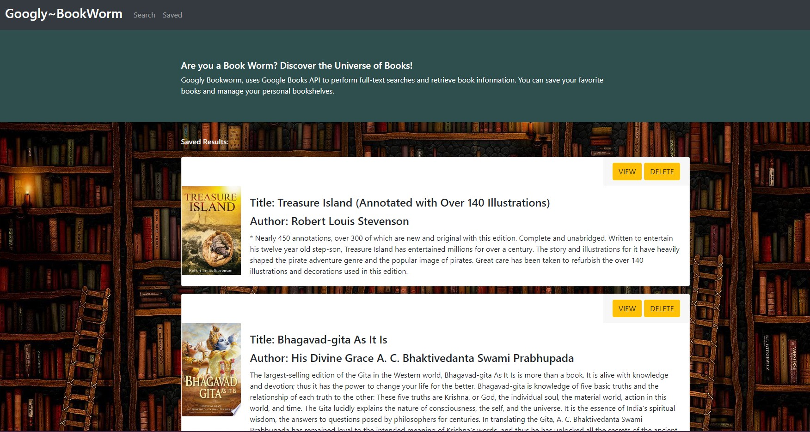

# Googly-Bookworm!

## Table of contents

1. [Description](#description)

2. [Install Guide](#install)

3. [Usage](#usage)

4. [Credits](#credits)

5. [screenshots](#screenshots)

6. [URL](#url)
        
<div id="description"/>
        
## Description
```
Googly-Bookworm, is a React-baased google Books Search App. Users can save books to their bookshelves, and can query, review or purchase later.
```
        
<div id="install"/>
        
## Installation Instruction
```
* Node JS, mongoose, mongoDB, express, express-handlebars, React and associated npm packages, concurrently. 
* This application uses nodeJS as runtime platform. 
* It uses mongodb and mongoose package to persist the data in a database. 
* It uses express package/library to handle the AJAX requests
* It uses React and React Hooks to have dynamic and smooth rendering behavior in the front-end. 
* This is MVC (Model, View, Controller) application, where the application fuctionality is compartmentalized into client, server and database categories, for the ease of maintanence and flexibility and scalability of the application.
```
        
<div id="usage"/>
        
## Usage
```

* The applicated is version controlled in github and is hosted in Heroku. 
* The initial load of the page will provide two menu option,
    1) Search for books from google books API, and option to save the book to database collection or view the book details and purchase if interested directly from google-books.
    2) Query the saved books to review or purchase later. Also have option to remove the book from the saved list.
* The power of React can be noticed, when a book is removed from the saved list and how only the affected component is rendered, not the whole page.
```

<div id="credits"/>
        
## Credits
```
* StackOverflow
* Google FUgit 
```       
       
<div id="screenshots"/>
        
## Screenshots

<ins>Initial Page Load - Screenshot:</ins>


<ins>Search Google Books API - Screenshot:</ins>


<ins>Saved Books - Screenshot:</ins>



    
      
<div id="url"/>
        
## URL:

GitHub Repository: https://github.com/meenaambalam/googly-bookworm

Heroku application URL: https://googly-bookworm.herokuapp.com/
